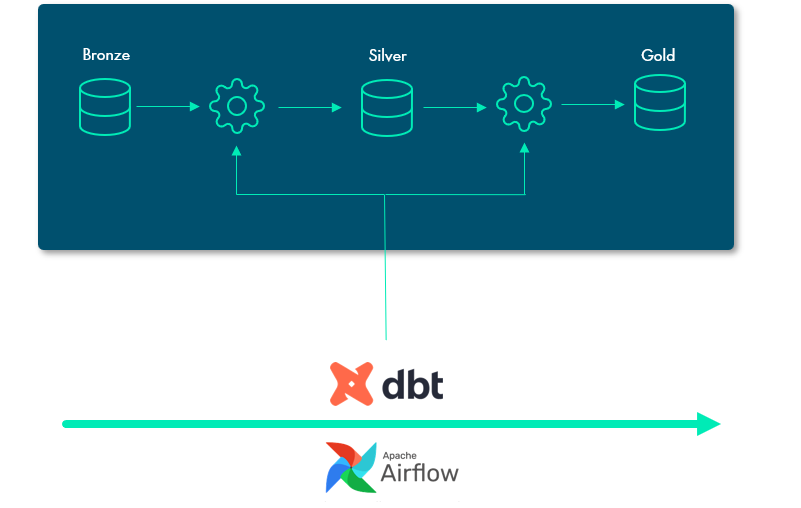

<!-- paginate: true -->
<!-- _class: invert -->

### Implantação 
### Datawarehouse 

### Prontocardio

<!-- footer: by: Amorim [Dados]-->
---
<!-- backgroundRepeat: true -->
<!-- color: invert -->

# O que é um Data Warehouse?

 

###### Definição:
- Repositório centralizado de dados, otimizado p/ análises, relatórios e alto desempenho para consultas analíticas.

###### Características:
- Armazena dados históricos;
- Integra dados de diversas fontes;
- Camadas: _'staging'_, _'masterdata'_ e _'datamart'_.

###### Arquitetura proposta:
- Modern Data Stack: Ferramentas modernas p/ otimizar pipeline de dados.

---
<!-- color: invert -->

# Problemas Atuais da Arquitetura do ERP

 

######  Situação Atual:

- Painéis PowerBI conectados diretamente no banco de dados do Oracle.
- Desvantagens:

    * ❌ Cada painel usa queries específicas sem documentação;
    * ❌ Falta de padronização e integração entre os painéis.
    * ❌ Inconsistências quando dados de painéis diferentes são cruzados.
    * ❌ Confusão e dúvidas quanto à credibilidade dos dados.

---
<!-- color: invert -->

## Para que Serve um Data Warehouse no Hospital?

 

###### Objetivos:

- Centralizar, integrar e organizar dados de diversas áreas do hospital (financeiro, clínicas, administração);
- Facilitar a criação de relatórios padronizados e confiáveis para a gestão e tomada de decisão.

###### Benefícios Operacionais:

- Unificação de dados de várias fontes (ERP, sistemas externos).
- Geração de insights mais precisos e confiáveis sobre eficiência operacional, custos, e atendimento ao paciente.

---
<!-- color: invert -->

## A Importância de um Data Warehouse no Hospital

 

###### Apoio à Decisão:

- Melhorar a eficácia nas decisões com base em dados precisos e consolidados.

###### Segurança e Conformidade:

- Armazenamento centralizado e historização de dados para 

- auditorias e compliance.

###### Desempenho:

- Menos sobrecarga no banco de dados do sistema ERP, já que o DW suporta consultas complexas sem impactar operações.

---
<!-- color: invert -->

## Ganhos com a Implantação de um Data Warehouse

 

###### 1. Confiabilidade dos Dados:

    - Padronização e governança de dados, eliminando inconsistências entre os relatórios.

###### 2. Performance:

    - Consultas otimizadas sem impactar o sistema de produção.

###### 3. Escalabilidade:

    - Expansão para novas áreas e integração de novos sistemas com facilidade.

###### 4. Tomada de Decisão Rápida:

    - Acesso a relatórios em tempo real e análises de dados integradas.

---
<!-- color: invert -->

# Arquitetura Proposta - Modern Data Stack

 

###### Pipeline ELT Orquestrado:

- `Airflow` Plataforma de orquestração de workflows que automatiza e gerencia processos complexos de dados. Será utilizada para orquestrar o pipeline ELT (Extração, Carga e Transformação), garantindo que cada etapa do processo seja executada corretamente e no tempo certo.

- `Astro` solução otimizada para o Airflow, facilita a operação e gestão de pipelines em produção. Astro vai permitir a gestão eficiente do Airflow e a execução confiável dos pipelines no ambiente de produção.

---
<!-- color: invert -->

###### Transformação e Modelagem de Dados:

- `dbt-core` Ferramenta de transformação de dados que permite criar modelos de dados transformados em SQL. No projeto, o dbt será utilizado para transformar os dados nas camadas staging, masterdata e datamart, garantindo que os dados estejam organizados e prontos para análise no DW.

- `Cosmos` Integração entre o Airflow e o dbt; para automatizar a execução de transformações de dados no dbt orquestrado pelo Airflow, proporcionando uma automação fluida e sem interrupções.

###### PowerBI:

- `Modelo de dados` Plataforma de visualização de dados e business intelligence. O Power BI será integrado ao Data Warehouse para permitir o desenvolvimento de painéis interativos, com dados unificados e confiáveis diretamente do DW, melhorando a qualidade dos insights gerados.

---
<!-- color: invert -->

---
<!-- color: invert -->

---
<!-- color: invert -->

### Comparativo - Arquitetura Atual vs. Arquitetura com DW

| Características | Atual (ERP) | Proposta (DW) |
|:---------------:|:-------------:|:---------------:|
|`Armazenamento de Dados` |	`Banco de dados do ERP`| `Data Warehouse` |
|Execução de Queries` | Em tempo real, direto no ERP | Queries otimizadas no DW |
|Integração de Dados | Fragmentada, sem padronização | Integrada e padronizada |
|Confiabilidade	| Inconsistencia nos painéis | Dados unificados e consistentes |
|Desempenho | Impacto no sistema ERP | Querys sem impacto no ERP |
|Documentação de Relatórios	| Ausente | Gerada pelo dbt  |

---
<!-- color: invert -->

# Benefícios Estratégicos da Implantação

###### 1. Governança de Dados:

- Padronização e controle da qualidade dos dados.

###### 2. Performance dos Sistemas:

- Liberação do banco de dados do ERP para operações críticas, aumentando a performance.

###### 3. Escalabilidade para Novos Relatórios:

- Criação de novos relatórios com rapidez e consistência.

###### 4. Colaboração:

- Integração do time de dados com ferramentas de orquestração (Airflow) e transformação (dbt).

---
<!-- color: invert -->

